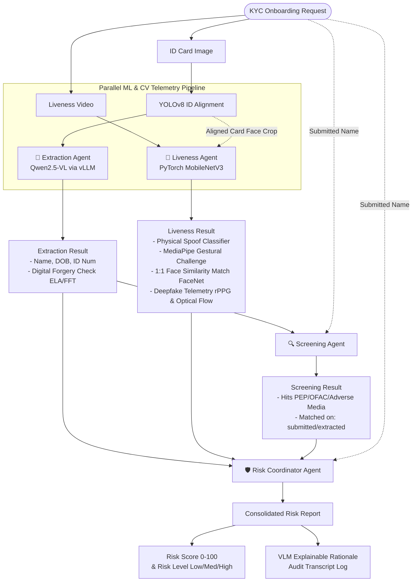

# Agentic KYC Intelligence Platform

An automated, secure, and explainable Multi-Agent Customer Due Diligence (KYC) pipeline designed to run on high-performance **AMD Instinct ROCm-accelerated platforms** (like MI300X).

The platform ingests a user's ID card image and a 3-second liveness face video, executes a pipeline of specialized agents in parallel, and presents a consolidated risk scorecard and audit log in a Streamlit review dashboard.

---

## 🚀 Beginner Quick Start (This Session)

If you are setting up or running the project for the first time, follow this step-by-step guide.

### Step 1: Clone the Repository
Clone the repository:
```bash
git clone https://github.com/i-m-afk/kyc-agentic-platform.git
cd kyc-agentic-platform
```

### Step 2: Environment Setup
Create a virtual environment and install all dependencies:
```bash
# Create python venv
python3 -m venv venv

# Activate venv
source venv/bin/activate

# Install requirements
pip install --upgrade pip
pip install -r requirements.txt
```

### Step 3: Model Weights (Liveness & Vision)
* **Liveness Model (`liveness_model.pt`)**: The trained liveness classification model is already saved in the repository root. **You do not need to retrain it** unless you explicitly want to.
  * *Optional training*: If you want to retrain the model, run the Jupyter notebook `notebooks/train_liveness_model.ipynb` or run:
    ```bash
    python3 src/training/train_liveness.py
    ```
* **Extraction Model (Qwen2.5-VL)**: Start the OpenAI-compatible vLLM server to host the Vision model. (Make sure to run this in your global/system environment where `vllm` is installed by running `deactivate` first if your local `venv` is active):
  ```bash
  # Deactivate local venv to use global vllm installation
  deactivate

  # Spin up the vLLM server on port 8000
  vllm serve Qwen/Qwen2.5-VL-7B-Instruct \
      --port 8000 \
      --trust-remote-code \
      --dtype bfloat16 \
      --max-model-len 32768 \
      --limit-mm-per-prompt '{"image":2,"video":1}'
  ```
  *(Wait ~60 seconds for the vLLM server to log `Uvicorn running on http://localhost:8000` before running the pipeline).*

### Step 4: Run the Streamlit Dashboard
Start the dashboard in **production mode** (utilizing the real vLLM and PyTorch models instead of mock rules). Note that we disable CORS and XSRF protection so that Streamlit can be accessed through proxy environments (like Jupyter Server Proxy):
```bash
# Set MOCK_ML to false to enable real model execution
MOCK_ML=false PYTHONPATH=. streamlit run src/app.py \
    --server.port 8501 \
    --server.address 0.0.0.0 \
    --server.enableCORS=false \
    --server.enableXsrfProtection=false
```

### Step 5: Accessing the Dashboard & Running App
1. Access the UI via your browser (e.g. replacing `/lab` with `/proxy/8501/` in your Jupyter URL).
2. Because of Streamlit's file uploader proxy limitations, **do not upload files directly**. Instead, select the preloaded files from the **"Choose from uploads/ folder"** dropdown in the sidebar!
3. Select an applicant (e.g., `Alice Smith` or `Charlie Davis`) and click **Run KYC Pipeline** to trigger real-time AI document extraction, deepfake/liveness check, and screening!

---

## 1. Agent Topology & Architecture

The pipeline uses a functional, stateless multi-agent topology to avoid state-machine overhead and maintain deterministic execution:

1.  **Extraction Agent (Vision-Language & CV Forensics)**:
    * Hosts **Qwen2.5-VL-7B-Instruct** using an optimized **vLLM** endpoint on ROCm (with a local EasyOCR fallback).
    * Extracts document data (Name, DOB, ID Number) into validated Pydantic models.
    * Performs programmatic validation of ID syntax and measures card legibility.
    * Runs **Zero-Shot Digital Forgery & AI Generation Checks** using parallelized computer vision diagnostics:
      * **Error Level Analysis (ELA)**: Detects compression rate inconsistencies to flag localized image edits.
      * **Fast Fourier Transform (FFT) Spectral Analysis**: Analyzes frequency spikes to catch periodic grids native to GAN/diffusion generated images.
2.  **Liveness Agent (Anti-Spoofing & Biometrics)**:
    * Executes a custom-trained **MobileNetV3 PyTorch Classifier** on AMD GPU hardware to detect physical presentation spoofs (such as printed photos or iPad replays).
    * Validates compliance against randomized gestural challenges (e.g. "3 fingers near cheek") using **MediaPipe Hands** (with a contour-based OpenCV fallback).
    * Runs **FaceNet / ArcFace** to perform 1:1 biometric facial comparison between the ID card photo and the live video face.
    * Captures sub-visual physiological biometrics:
      * **Green-channel rPPG (Remote Photoplethysmography)**: Measures pulse wave variation to verify living skin tissue.
      * **Dense Optical Flow (Farneback)**: Analyzes micro-warping boundary seams to flag temporal face-swap overlays.
3.  **Screener Agent (Compliance)**:
    * Performs PEP, OFAC, and Adverse Media screening on **both** the submitted applicant name and the extracted ID card name.
    * Tags every hit with a `matched_on` attribute for compliance transparency.
4.  **Risk Coordinator Agent (Consolidator)**:
    * Combines all outputs in a single consensus calculation.
    * Features a dual **Cognitive LLM Decision Coordinator** and **Rule-Based Fallback** mechanism. It attempts to send formatted biometric and compliance telemetry to local vLLM models for semantic coordination, and gracefully falls back to deterministic rule scoring if the server is offline.
    * Assigns explainable risk flags, calculates the consolidated 0-100 score, and decides the final application status (LOW/MEDIUM/HIGH).

### Architecture Data Flow



---

## 2. Project Directory Structure

```text
├── notebooks/
│   └── train_liveness_model.ipynb   # Liveness model training notebook
├── src/
│   ├── agents/                      # Stateless agent modules
│   │   ├── extraction.py            # YOLOv8 crop/warp & VLM text extraction
│   │   ├── liveness.py              # CNN classifier, MediaPipe, FaceNet, rPPG, Optical Flow
│   │   ├── screener.py              # PEP/watchlist & adverse media matcher
│   │   └── risk_coordinator.py      # Risk scorecard VLM compiler & fallbacks
│   ├── schemas/                     # Pydantic validation schemas
│   │   └── models.py
│   ├── training/                    # Model training scripts
│   │   └── train_liveness.py
│   ├── utils/                       # DB mock and video handling helpers
│   │   ├── ai_image_forensics.py    # Parallelized CV-based image forensics
│   │   ├── db.py                    # Mock watchlist & adverse media database
│   │   └── helpers.py               # Env configuration and download utilities
│   └── app.py                       # Streamlit dashboard interface
├── tests/                           # Integration and unit tests
└── README.md                        # Project documentation
```

---

## 3. JupyterLab (AMD GPU Container) Setup

If you are running in a JupyterLab server environment on `notebooks.amd.com` with an **AMD Instinct MI300X** GPU, follow these steps to execute the application.

### Step A: Clone & Environment Setup
Open a Jupyter terminal and navigate to the project directory:
```bash
# Navigate to workspace
cd /workspace/shared/kyc-agentic-platform

# Create and activate virtual environment
python3 -m venv venv
source venv/bin/activate

# Install dependencies
pip install --upgrade pip
pip install -r requirements.txt
```

### Step B: Serve the Vision LLM using vLLM on ROCm
In a new Jupyter terminal tab, start the local vLLM OpenAI-compatible server to host the extraction model (Qwen2.5-VL). Run this in the system environment where `vllm` is installed (deactivate `venv` if active):
```bash
# Deactivate local venv to use global vllm installation
deactivate

# Verify GPU visibility
rocm-smi || nvidia-smi

# Spin up the vLLM server on port 8000
vllm serve Qwen/Qwen2.5-VL-7B-Instruct \
    --port 8000 \
    --trust-remote-code \
    --dtype bfloat16 \
    --max-model-len 32768 \
    --limit-mm-per-prompt '{"image":2,"video":1}'
```

### Step C: Train the Liveness Model (Anti-Spoofing)
1. Open `notebooks/train_liveness_model.ipynb` in JupyterLab.
2. Run all cells. The notebook will automatically download the **LFW dataset**, apply advanced physics-informed print/replay spoof simulations (Moire grid, glares, borders), split it, and train a MobileNetV3 binary classifier on the AMD GPU.
3. The dataset will be downloaded and prepared at:
   - Absolute Path: `/workspace/shared/kyc-agentic-platform/notebooks/liveness_dataset`
4. The notebook will output the trained model to `notebooks/liveness_model.pt`. To deploy it, copy it to the root of the workspace or update the environment path:
   ```bash
   cp notebooks/liveness_model.pt ./liveness_model.pt
   ```

### Step D: Run the Streamlit Dashboard
In another Jupyter terminal tab, run the Streamlit review dashboard. Disable CORS and XSRF protection to allow proxied access:
```bash
source venv/bin/activate

# Launch dashboard on port 8501
streamlit run src/app.py \
    --server.port 8501 \
    --server.address 0.0.0.0 \
    --server.enableCORS=false \
    --server.enableXsrfProtection=false
```

### Step E: Access the UI via Jupyter Server Proxy
To open the Streamlit dashboard in your local browser, copy your current JupyterLab browser URL (e.g., `https://notebooks.amd.com/jupyter-hack-team-XXXX/lab`) and replace the `/lab` suffix with `/proxy/8501/`:

```text
https://notebooks.amd.com/jupyter-hack-team-XXXX/proxy/8501/
```
Paste this URL into a new browser tab to view and interact with the KYC review platform.

---

## 4. Troubleshooting & Error Resolution

If you encounter errors during run-time:

### Issue 1: `liveness_model.pt` Not Found
* **Symptoms**: The pipeline fails during video evaluation or liveness checking.
* **Resolution**: Ensure you copy the trained weights from the notebook directory to the workspace root, or run the training notebook to generate it. If you wish to run in mock mode without any ML assets, set:
  ```bash
  export MOCK_ML=true
  ```

### Issue 2: CUDA/ROCm Out Of Memory (OOM)
* **Symptoms**: `RuntimeError: CUDA out of memory`.
* **Resolution**: This happens if the vLLM server and the PyTorch training notebook try to allocate GPU memory simultaneously.
  - Decrease vLLM's max GPU utilization:
    ```bash
    python -m vllm.entrypoints.openai.api_server --gpu-memory-utilization 0.7 ...
    ```
  - Limit the training notebook's batch size to `16` or `8`.

### Issue 3: OpenCV Video Parsing Failures
* **Symptoms**: Video uploads fail with "No frames extracted" or OpenCV cannot read frames.
* **Resolution**: Make sure the uploaded video file has a valid container (MP4) and is between 2-5 seconds in length. In headless server environments, make sure `opencv-python-headless` is installed instead of `opencv-python`.

### Issue 4: vLLM API Connection Refused
* **Symptoms**: Extraction agent times out or throws `ConnectionError` connecting to `localhost:8000`.
* **Resolution**: Ensure the vLLM server in Step B is fully initialized. Initialization can take 1-2 minutes depending on connection speeds. Verify the port matches `VLLM_API_URL` (default: `http://localhost:8000/v1`).
